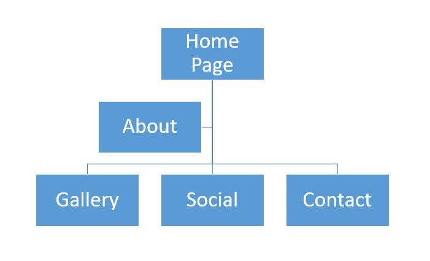
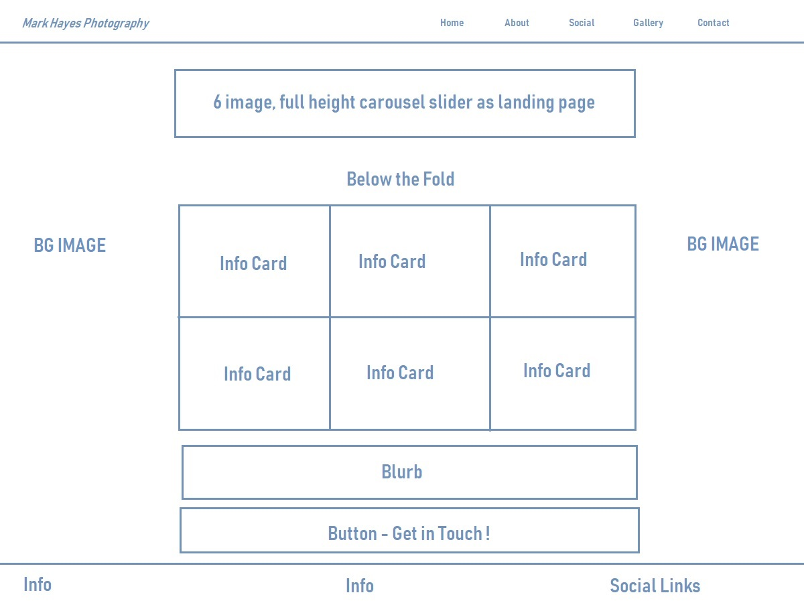

# Mark Hayes Photography

This is a  responsive website designed for an independent photographer who is starting out in the business.  The idea for the website is to highlight and showcase the different services and options available to users who want to work with the photographer.

Please click [here](https://5803emma.github.io/sports-photographer-project/) for a live demo of the website 

# UX

The objective for this website is to illustrate the flexibility and range of the photographer.  There is slightly more of an emphasis on sports photography as this is the greatest area of interest for the photographer and is also quite a unique selling point, as there are very few independent amateur sports photographers in Ireland. 

In order to achieve the above, the user is greeted with images and short descriptions of past projects completed by the photographer.  In doing so, the user will see the variety of services on offer and the high standard of work carried out to date.

The decision to utilise a mobile-first approach was taken due to the high volume of users who browse the web on mobile phones, tablets and other devices outside of the desktop environment.

In the planning stages it became clear that the potential client base for the service was very wide-ranging.  Broadly speaking, there are four different categories of photograpy on offer; being sports, aerial, commercial and miscellaneous.  As an example, a site user may visit the page to request the presence of the photographer at one of their upcoming club hurling games, whilst another user may want to have aerial photographs of their home/business taken.  With that in mind, it was important that the landing page encompassed a large variety of services catered for.

However, it was important not to overload the user by placing too much text-based info on the home page.  To that end, the different services are divided and sectioned.  There is a relevant image accompanying each info card which links to a gallery of sample images. Initially, there were 12 potential categories which could have been displayed on the homepage, but merging similar themes meant that these categories could be reduced by half and the gallery page was linked providing user access to broader examples.

## User Stories

- As a club soccer coach interested in working with an independent sports photographer, I would like to see previous photos from games attended by the photographer.  I want to be able to find the relevant spots photography page on social media.  I would  like to know how to get in contact with the photographer and how to book him to attend league and championship games and take photos of the team.
- As a local newspaper editor I would be interested in working with a freelance photographer who attendings sporting and community events.  I could then publish photos from these events and games in my newspaper.  I would want to see the photoprapher's previous work, to learn a bit about him as a person, and to know that there are multiple ways of contacting him should he be required at short notice for an event. 

## Wireframes

## Features

There is a fixed responsive navbar at the top of the page which displays five visible links.  The navbar is displayed on all five pages.

Across all five pages, clicking on the M H Photography logo will also bring the user to the home page, or index.html.

### Home Page

There is carousel displaying six photos broadly representing the six different categories of photography offered.  This carousel greets the user when they first visit the page.

There are 6 card features which display the different types of photography offered. The cards hold images and links to the gallery page of the website.

There is a button at the end of the page which encourages the user to get in contact with the photographer.  This button links to the contact page. 

### About Page

As well as some images and background information about the photographer, there are two embedded YouTube videos on this page.

### Social Page

There is a panoramic landing image and three info cards on this page. Each card has a button which will open a new tab for the user and direct them to the social media profile they wish to visit.

### Gallery Page

There are 24 images thumbnail images on this page.  Clicking on any one of the images will allow the user to navigate through a responsive FancyBox gallery.  There is a button at the bottom of this page which links the user to the Social page of the website should they wish to view more images on social media.

### Contact Page

The contact page has a section which details the address, phone number and e-mail of the photography service.

There is also a bootstrap contact form which encourages the user to fill in their details and a message and submit to the website if they are interested in booking the photographer to attend their event. 

### Footer

The footer is fixed to the bottom of all five pages and holds a brief one-line summary about the photographer, a line stating that the website was designed for education purposes, and three font-awesome icons which link to the Facebook, Twitter and Instagram profiles of the photographer.

### Features Left to Implement

In the future I would like to add feature to the page that allows users to purchase prints directly from the photographer.  I would also like to add a calendar schedule to the site which the photographer could populate with upcoming events and games, as well as highlight availability for booking.

## Technologies Used

- [Bootstrap](https://getbootstrap.com/) 
   -Bootstrap was the framework employed in order to create responsive design and plan the website layout. 
- [Fontawesome](https://fontawesome.com/start)
    - FontAwesome was used to style the social links in the footer.
- [Fancybox](http://fancyapps.com/fancybox/3/)
    - Fancybox was used to implement the gallery.
- [FavIcon](https://www.favicongenerator.com/)
  - The FavIcon generator was employed to create the website icon.
- [Git](https://git-scm.com/)
  - Git was used to commit the project at various stages.
- HTML
- CSS

## Testing 

 - Google Chrome developer tools were used to test responsiveness across various   devices sizes and operating systems
 - I used [Browserling](https://www.browserling.com/) to test the website across   multiple browsers to ensure compatability and responsiveness.
 - The Bootstrap enquiry form requires that a valid e-mail address is entered.    If not, a note will appear to advise the client to enter a valid e-mail        address.
 - The contact form on the contact page also contains the required attribute for   email and phone number, and this functions correctly
 - The hover styling on the navbar and the links were manually tested and all     were operational.
 - All buttons across the site pages were manually tested and operational
 - HTML and CSS code were checked on the [W3C Markup](https://validator.w3.org/) and [CSS Jigsaw](https://jigsaw.w3.org/css-validator/) validators
 - Manually tested the three social links which all open in a new browser window   and link to their intended pages. 

### Issues when Testing

- The responsive image gallery displayed the images correctly when in the arrow navigation view (when clicked) but in the thumbnail gallery view they looked out of proportion.  I tried to address this in CSS by setting height and width to 100% but this stretched the portrait images and, for want of a better word "squashed" the landscape images.  I removed the height property which restored the thumbnail images to their correct proportions, but they were then all different size thumbnails.

- I linked the website to friends and family to see if they could find issues that I might have been missing due to over-familiarity with the site.  I asked asked for feedback about the UX.  I received positive feedback, the only issue that was reported was that some of the images were a bit slow to load.  I ran these files through the tinyjpg website, however, as they were extremely large files to begin with, this did not reduce the size by as much as I had hoped.

### Addressing testing from User Stories 

*"As a club soccer coach interested in working with an independent sports photographer, I would like to see previous photos from games attended by the photographer.  I want to be able to find the relevant spots photography page on social media.  I would  like to know how to get in contact with the photographer in order to book him to attend league and championship games and take photos of the team."*  

This customer's experience has been satisfied as the first thing as a visitor to the site that they will see are sports images in the full-height carousel. Scrolling down on the homepage they will see hurling and soccer as the first two info cards.  At this stage they have the option to click a button on the homepage which will bring them to the contact page. Alternatively, they can click on the info-card image or link to direct them to more sports images in the gallery page.  The gallery page is a small selection of the various categories of photography.  There is a button at the end of the gallery page which links to the social page of the site, where this user can connect with MH Sports Photography on Facebook.  They have many options availble to them to get in contact with the photographer and the site makes it clear that all enquiries are welcome.

*"As a local newspaper editor I would be interested in working with a freelance photographer who attendings sporting and community events.  I could then publish photos from these events and games in my newspaper.  I would want to see the photoprapher's previous work, to learn a bit about him as a person, and to know that there are multiple ways of contacting him should he be required at short notice for an event."*

Again this customer's experience has been met as the site landing page features images of completed work.  Also on the home page there is images with links and a brief description of each service provided and the flexibility of the categories. The gallery page showcases a small sample of the photographers work across these categories and provides a number of different means by which to get in contact.

## Deployment

The website is hosted using GitHub pages which were deployed directly from the master branch. The site that is deployed will automatically update itself when new commits are made to the master branch. 

To run the code locally, you must clone this repository directly into an editor of your choosing and paste into your terminal `git clone https://github.com/cgaynor91/John-Gaynor-Construction.git`

## Credits

### Thanks
Thanks to Anna_lead for the idea to use FancyBox for the responsive gallery, as seen in her [portrait artist website](https://ajgreaves.github.io/portrait-artist/gallery.html) which she kindly linked on Slack for those of us who were struggling!
   
### Content

- Inspiration for some of the text on the site was derived from the style of leading Irish sports photography websites [ INPHO Photography](https://inpho.ie/) and [Sportsfile](https://www.sportsfile.com/)
   
### Media
   
- Photos are all original images by [Mark Hayes Photographer](https://www.sportsfile.com/)
- The Youtube channels referenced on the site belong to [Jared Polin](https://www.youtube.com/user/JaredPolin) and [Thomas Heaton](https://www.youtube.com/channel/UCfhW84xfA6gEc4hDK90rR1Q)
- The footer styling using the Fontawesome social media links was taken from Code Insititutes Bootstrap Portfolio Project; then adapted and customised to suit the page
- FavIcon was generated using the online [FavIcon Generator](https://www.favicongenerator.com/)

## Acknowledgements

Thanks to a very kind and patient husband, who happens to also be a wonderful sports photographer ;-)

